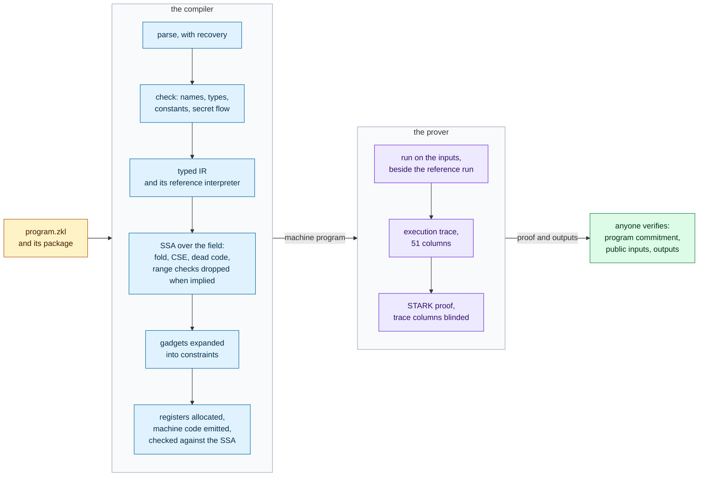
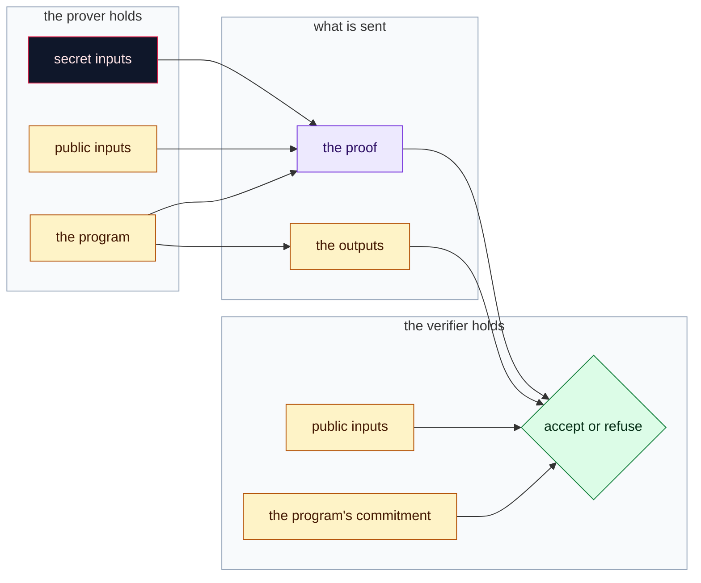
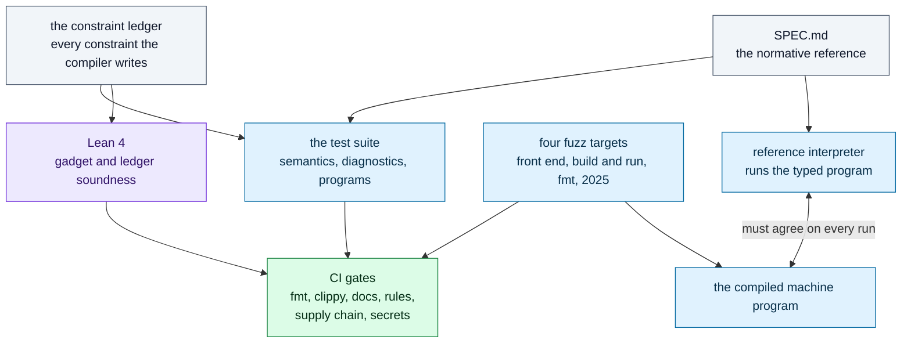
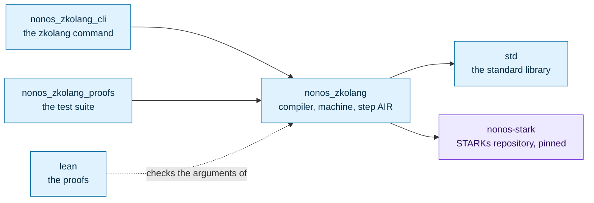

<!-- NONOS. AGPL-3.0-or-later. -->

<div align="center">

# zKølang

**A programming language whose runs are proven.**

You write a program, run it on public and secret inputs, and get back a STARK proof that it
ran exactly as written and produced exactly these outputs. Anyone can check the proof. There
is no trusted setup, no elliptic curve in the proof system, and the secret inputs are not
part of what the verifier sees.

[](https://github.com/NON-OS/zkolang/actions/workflows/rust.yml)
[](https://github.com/NON-OS/zkolang/actions/workflows/lean.yml)
[](https://github.com/NON-OS/zkolang/actions/workflows/fuzz.yml)
[](https://github.com/NON-OS/zkolang/actions/workflows/security.yml)

Edition 2026 · compiler 0.1.0 · AGPL-3.0-or-later

</div>

> [!WARNING]
> **Pre-audit.** Nothing here has had an external audit. The compiler and the prover are
> tested, fuzzed and partly machine-checked, as this page says in detail, but do not put
> value you cannot lose behind a proof made with it.

## Contents

1. [A first look](#a-first-look)
2. [From a program to a proof](#from-a-program-to-a-proof)
3. [Install](#install)
4. [Learn the language in nine programs](#learn-the-language-in-nine-programs)
5. [The toolchain](#the-toolchain)
6. [What you can build today](#what-you-can-build-today)
7. [What is not there yet](#what-is-not-there-yet)
8. [How it is kept correct](#how-it-is-kept-correct)
9. [Under the hood](#under-the-hood)
10. [Edition 2025](#edition-2025)
11. [The repository](#the-repository)

## A first look

A sealed-bid auction. Four bids go in secret; the proof says who won and at what price, and
nothing about the bids that lost.

<!-- proves secret=120,450,300,90 outputs=1,450 -->
```rust
struct Bid {
    bidder: u32,
    amount: u64,
}

fn best<const N: usize>(bids: [Bid; N]) -> Bid {
    let mut top = bids[0];
    for i in 1..N {
        if bids[i].amount > top.amount {
            top = bids[i];
        }
    }
    top
}

fn main(amounts: secret [u64; 4]) -> (u32, u64) {
    let mut bids = [Bid { bidder: 0, amount: 0 }; 4];
    for i in 0..4 {
        bids[i] = Bid { bidder: i as u32, amount: amounts[i] };
    }
    let w = best(bids);
    (declassify(w.bidder), declassify(w.amount))
}
```

```text
$ zkolang run auction.zkl --edition 2026 --secret 120,450,300,90
verified
outputs [1, 450]
rows 1889  trace 2^11
```

Bidder 1 won at 450. The losing bids are secret inputs: they feed the run, they are not
part of the statement the proof is checked against, and the compiler would have refused the
program if any of them could reach the result without the `declassify` that marks where
revealing is intended.

## From a program to a proof



Each box is code you can read. The front end and checker are under
`nonos_zkolang/src/compiler/syntax` and `sema`; the IRs under `tir` and `ssa`; the passes
under `opt` and `gadget`; the back end under `schedule` and `codegen`; the run and the proof
under `compiler/driver` and `driver`. The compiled program and the reference interpreter run
side by side on every input, and a run where they disagree is reported as a compiler bug
rather than proven.

What each party holds:



The verifier checks the proof against the program's commitment, the public inputs and the
outputs, and against nothing else. Every trace column is blinded with a random polynomial
drawn from a seed `zkolang run` reads fresh from the system for each proof, one random
coefficient for each point the proof opens the column at, so the trace values a proof
reveals are jointly uniform. [SECURITY.md](SECURITY.md) states what that does and does not
cover.

## Install

zKølang is built from source with Rust. CI builds it with Rust 1.99.0; any recent stable
release should do.

```sh
git clone https://github.com/NON-OS/zkolang
cd zkolang
cargo build --release -p nonos_zkolang_cli
export PATH="$PWD/target/release:$PATH"
zkolang --version
```

The prover, `nonos-stark`, is fetched by cargo from the public
[STARKs repository](https://github.com/NON-OS/STARKs) at the commit the manifests pin.

## Learn the language in nine programs

Every program in this section is run by a test, `readme_tests`, in the state the line above
it says: proven with these outputs, failing, refused, or with its tests passing. If the
language changes under one of them, that test fails.

### 1. A first proof

`main`'s parameters are the inputs, each labelled `public` or `secret`, and its result is
the output.

<!-- proves public=12 outputs=144 -->
```rust
fn main(x: public u32) -> u32 {
    x * x
}
```

```text
$ zkolang run square.zkl --edition 2026 --public 12
verified
outputs [144]
rows 260  trace 2^9
```

### 2. Integers that do not wrap

A `u32` is a `u32`: if `x * x` does not fit, the run fails, and a failed run has no proof.
The compiler writes the range checks that make this so; they are listed, with the argument
that each is sound, in the [constraint ledger](docs/audit/constraints.md).

<!-- fails public=70000 -->
```rust
fn main(x: public u32) -> u32 {
    x * x
}
```

```text
$ zkolang run square.zkl --edition 2026 --public 70000
error[E0905]: the run fails: arithmetic overflow
 --> square.zkl:2:9
  |
2 |     x * x
  |         ^ fails here
square.zkl: the run was not proved
```

`field` is the one type that does wrap: it is the integers modulo
`p = 2^64 - 2^32 + 1`, the arithmetic the proof itself is made of, and the cheapest.

### 3. Knowing a secret

A proof that you know an `x` with `x³ + x + 5 = 35`, without saying what `x` is.

<!-- proves public=35 secret=3 outputs=35 -->
```rust
fn main(y: public field, x: secret field) -> field {
    assert x * x * x + x + 5 == y, "x is not a root";
    y
}
```

With a wrong `x` the `assert` fails, the run stops there, and there is no proof to forge.

<!-- fails public=35 secret=4 -->
```rust
fn main(y: public field, x: secret field) -> field {
    assert x * x * x + x + 5 == y, "x is not a root";
    y
}
```

### 4. Revealing on purpose

A value computed from a secret is secret. Reaching `main`'s result is revealing it, so the
compiler requires `declassify` at that point, which makes every place a secret leaves the
program something you wrote and can find with `zkolang check --declassify`.

<!-- refused E0600 -->
```rust
fn main(threshold: public u32, salary: secret u32) -> bool {
    salary >= threshold
}
```

```text
error[E0600]: a secret value reaches the result of `main`, which is public
 --> salary.zkl:2:5
  |
2 |     salary >= threshold
  |     ^^^^^^^^^^^^^^^^^^^ derived from a secret
  |
  = help: use `declassify(e)` if revealing this value is intended
```

<!-- proves public=50000 secret=52000 outputs=1 -->
```rust
fn main(threshold: public u32, salary: secret u32) -> bool {
    declassify(salary >= threshold)
}
```

The proof says the salary clears the bar, and nothing about the salary.

### 5. Structs and generics

The auction of the first section, again: a `struct`, a function generic over the length of
an array, a loop, and two values revealed.

<!-- proves secret=7,3,9,1 outputs=2,9 -->
```rust
struct Bid {
    bidder: u32,
    amount: u64,
}

fn best<const N: usize>(bids: [Bid; N]) -> Bid {
    let mut top = bids[0];
    for i in 1..N {
        if bids[i].amount > top.amount {
            top = bids[i];
        }
    }
    top
}

fn main(amounts: secret [u64; 4]) -> (u32, u64) {
    let mut bids = [Bid { bidder: 0, amount: 0 }; 4];
    for i in 0..4 {
        bids[i] = Bid { bidder: i as u32, amount: amounts[i] };
    }
    let w = best(bids);
    (declassify(w.bidder), declassify(w.amount))
}
```

Generics take types and constants, and are compiled once per instance. `impl` blocks give a
type its methods, with `self`, `&mut self` and `Self`.

### 6. Enums, match and tests

A balance moved by a list of steps. `match` must cover every variant, which the checker
enforces, and an overdraft is a failed run. The `#[test]` functions run with
`zkolang test`, each compiled to the machine and run beside the reference interpreter;
`#[should_fail]` asserts that a run fails.

<!-- tests 2 -->
```rust
enum Step {
    Deposit(u64),
    Withdraw(u64),
    Fee,
}

fn apply(balance: u64, step: Step) -> u64 {
    match step {
        Step::Deposit(v) => balance + v,
        Step::Withdraw(v) => balance - v,
        Step::Fee => balance - 1,
    }
}

fn settle<const N: usize>(start: u64, steps: [Step; N]) -> u64 {
    let mut b = start;
    for i in 0..N {
        b = apply(b, steps[i]);
    }
    b
}

#[test]
fn steps_settle_in_order() {
    let steps = [Step::Deposit(50), Step::Withdraw(30), Step::Fee];
    assert settle(100, steps) == 119;
}

#[test]
#[should_fail]
fn an_overdraft_has_no_proof() {
    let _b = settle(10, [Step::Withdraw(11)]);
}

fn main(start: public u64, deposits: secret [u64; 2], spend: secret u64) -> bool {
    let steps = [Step::Deposit(deposits[0]), Step::Deposit(deposits[1]), Step::Withdraw(spend), Step::Fee];
    declassify(settle(start, steps) >= 100)
}
```

```text
$ zkolang test ledger.zkl
running 2 tests
test steps_settle_in_order ... ok
test an_overdraft_has_no_proof ... ok
test result: ok. 2 passed; 0 failed
```

As a program, the same steps prove solvency without showing the balance: deposits of 40 and
60, a spend of 90 and a fee leave 109, so the result is that it is at least 100, and that is
all the proof says. The `main` of the file above, on its own:

<!-- proves public=100 secret=40,60,90 outputs=1 -->
```rust
enum Step {
    Deposit(u64),
    Withdraw(u64),
    Fee,
}

fn apply(balance: u64, step: Step) -> u64 {
    match step {
        Step::Deposit(v) => balance + v,
        Step::Withdraw(v) => balance - v,
        Step::Fee => balance - 1,
    }
}

fn main(start: public u64, deposits: secret [u64; 2], spend: secret u64) -> bool {
    let mut b = start;
    let steps = [Step::Deposit(deposits[0]), Step::Deposit(deposits[1]), Step::Withdraw(spend), Step::Fee];
    for i in 0..4 {
        b = apply(b, steps[i]);
    }
    declassify(b >= 100)
}
```

### 7. The standard library

`std` is written in zKølang and loaded beside every program. This proves a secret leaf sits
in a Merkle tree under a public root, with the path secret too.

<!-- proves public=4974174274453454789 secret=7,11,22,33,0,1,1 outputs=4974174274453454789 -->
```rust
use std::merkle::root;

fn main(r: public field, leaf: secret field, path: secret [field; 3], right: secret [bool; 3]) -> field {
    assert root(leaf, path, right) == r, "not a member";
    r
}
```

A leaf that is not in the tree fails at the `assert`:

<!-- fails public=4974174274453454789 secret=8,11,22,33,0,1,1 -->
```rust
use std::merkle::root;

fn main(r: public field, leaf: secret field, path: secret [field; 3], right: secret [bool; 3]) -> field {
    assert root(leaf, path, right) == r, "not a member";
    r
}
```

| Module | What it holds |
|---|---|
| `std::prelude` | `Option`, `Some`, `None`, `Result`, `Ok`, `Err`, in scope everywhere |
| `std::array` | `sum`, `product`, `dot`, `position`, `contains`, `reverse` over `[T; N]` |
| `std::cmp` | `clamp`, `within`, `abs_diff` |
| `std::poly` | `eval`, Horner evaluation of a polynomial |
| `std::curve` | short Weierstrass curves over `field`: points, addition, doubling |
| `std::hash` | the MiMC permutation and its two-to-one compression |
| `std::merkle` | a node, a step up a path, and the root of a path |

The full reference is [docs/stdlib.md](docs/stdlib.md), generated by `zkolang doc --std` and
held equal to it by a test.

### 8. Packages

A directory with a `zkolang.toml` is a package, and its dependencies are other packages by
path. Here a voting package uses a counting library.

<!-- file tally/zkolang.toml -->
```toml
[package]
name = "tally"
version = "0.1.0"
edition = "2026"
entry = "src/lib.zkl"
```

<!-- file tally/src/lib.zkl -->
```rust
/** How many of `votes` are yes. */
pub fn yes<const N: usize>(votes: [bool; N]) -> u32 {
    let mut n = 0;
    for i in 0..N {
        if votes[i] {
            n += 1;
        }
    }
    n
}
```

<!-- file vote/zkolang.toml -->
```toml
[package]
name = "vote"
version = "0.1.0"
edition = "2026"

[dependencies]
tally = { path = "../tally" }
```

Five ballots stay secret, and only whether the motion passed is revealed:

<!-- file vote/src/main.zkl -->
```rust
use tally::yes;

fn main(ballots: secret [bool; 5]) -> bool {
    declassify(yes(ballots) >= 3)
}
```

<!-- proves secret=1,0,1,1,0 outputs=1 root=vote/src/main.zkl -->
```text
$ zkolang run vote/src/main.zkl --secret 1,0,1,1,0
verified
outputs [1]
```

A manifest sets the edition, so a file it governs needs no `--edition`. Modules within a
package live in their own files, declared with `mod name;` and reached with `use`.

### 9. Knowing the cost

A proof's cost is the number of rows of its trace, at most 2^16. `zkolang check --cost`
says where they go, by function and by line:

```text
$ zkolang check ledger.zkl --edition 2026 --cost
2374 rows, 1036 outside any function; at most 9 registers live
inclusive exclusive  peak  function
     1338       274     7  main
     1064      1064     9  apply
     1064         0     0  settle::<4>
the lines that take the most rows
     1034  ledger.zkl:36  fn main(start: public u64, deposits: secret [u64; 2], spend: secret u64) -> bool {
      531  ledger.zkl:10  Step::Deposit(v) => balance + v,
      274  ledger.zkl:38  declassify(settle(start, steps) >= 100)
```

`field` arithmetic costs a row an operation. A fixed-width integer also pays for the range
checks that keep it in range. A function that takes more than half
the rows a trace can hold is warned about (W0102) where it is declared.

## The toolchain

| Command | What it does |
|---|---|
| `zkolang run <file> --public a,b --secret x,y` | compile, run, prove and verify; print the outputs |
| `zkolang check <file>` | check and compile, and count the rows; a crate with no `main` is checked as a library |
| `zkolang check <file> --cost` | the rows of each function and line |
| `zkolang check <file> --declassify` | each place a secret is revealed |
| `zkolang check <file> --json` | the diagnostics as one JSON array, for editors and CI |
| `zkolang test <file>` | run each `#[test]`, compiled and beside the reference interpreter |
| `zkolang abi <file>` | the layout of `main`'s inputs and result, slot by slot |
| `zkolang doc <file>` | a crate's reference, from its doc comments |
| `zkolang fmt <file> [--check]` | lay out a file's lines; `--check` only reports |
| `zkolang explain <code>` | what a diagnostic code means, for each of the codes the compiler reports |
| `zkolang key <file>` | a circuit's program commitment and verifier key |
| `zkolang fee <file>` | what a run costs to prove, in NOX |
| `zkolang build <file> --target c\|python` | the program as a C file or a Python script that runs it without a prover; `asm` too for edition 2025 |
| `zkolang lsp` | a language server on standard input and output, for any editor with an LSP client |

`--edition 2026` selects the language of this page for a file no manifest governs; without
it such a file is read as edition 2025. Diagnostics carry a code, a span and, where one
applies, a suggestion, including the names closest to one that does not resolve.

Running natively: `zkolang build --target c` writes a C file, and `--target python` a
Python script, that compute what a proven run computes, with no prover. Each takes one
argument per leaf of `main`'s inputs, the public ones then the secret ones, prints the
leaves of the result on one line, and exits with status 3 where a constraint fails, which
is where no proof exists. A test builds every program this page runs both ways, compiles the
C with every warning an error, and holds both to the reference run.

Editor support: `zkolang lsp` speaks the Language Server Protocol, publishing the
diagnostics of each open edition 2026 document as it changes, across the files of its
package, and laying a document out on request with `zkolang fmt`. A
[TextMate grammar](grammars) and a [VS Code extension](editors/vscode) highlight both
editions, and a [tree-sitter grammar](tree-sitter-zkolang) covers edition 2025.

## What you can build today

Each row is a program in this repository that is proven by its test suite.

| You want to prove | Where it is |
|---|---|
| a secret satisfies a public relation | [§3](#3-knowing-a-secret) |
| a secret clears a public threshold, and nothing else about it | [§4](#4-revealing-on-purpose) |
| the winner of a sealed-bid auction | [§5](#5-structs-and-generics) |
| a private balance stays solvent through a list of moves | [§6](#6-enums-match-and-tests) |
| membership in a Merkle tree, the leaf and path secret | [§7](#7-the-standard-library) |
| the outcome of a secret ballot | [§8](#8-packages) |
| the note commitment of the NØNOS shielded pool, in the language | [`circuits/shield/note_commit.zkl`](circuits/shield/note_commit.zkl), held equal to the deployed digest |
| a note spend and a transfer, as a language demonstration | [`circuits/shield`](circuits/shield) |
| kernel attestation, anti-rollback, capability and syscall checks | [`circuits/kernel`](circuits/kernel) (edition 2025) |
| elliptic curve point arithmetic | `std::curve`, and [`examples/curve`](examples/curve) |

## What is not there yet

Stated so nobody has to find out by surprise:

- **No external audit**, and no claim of full zero-knowledge: the trace columns are blinded,
  and the composition and FRI layers are not argued here ([SECURITY.md](SECURITY.md)).
- **Proofs are checked by this repository's verifier.** Verifying a zKølang proof on chain,
  or through the STARKs repository's `no_std` and browser verifiers, needs the program
  compiled to a STARKs program image, which is not built yet.
- **A trace holds at most 2^16 rows**, and there is no recursion that aggregates zKølang
  proofs yet.
- **Bounded programs only:** loops are unrolled, `while` carries a `limit`, there is no
  heap, and functions are inlined, so recursion is refused.
- **The tree-sitter grammar and the `asm` target** take edition 2025 only.

## How it is kept correct



- **A reference interpreter beside every run.** The typed program is interpreted directly and
  the compiled machine program runs beside it on the same inputs; a disagreement is reported
  as a compiler bug, never proven.
- **The constraint ledger.** [docs/audit/constraints.md](docs/audit/constraints.md) lists
  every constraint the compiler writes, why it is sound, and the test that rejects a run
  breaking it. Over the compiled programs of the suite, every advice value is checked to be
  pinned: change one and the program rejects.
- **Machine-checked arguments.** [lean](lean) holds Lean 4 proofs over the core library, with
  no `sorry` and no `native_decide`: the standard gadgets, the field, and the ledger's guard,
  bit decomposition, field bits, division and bounds checks. `lean/Axioms.lean` lists every
  theorem with the axioms it rests on, and CI fails if any rests on a placeholder.
- **Fuzzing.** [fuzz](fuzz) holds four targets seeded with the repository's programs: the
  front end on any text, any text built and run with the compiled and reference runs in
  agreement, the formatter's fixed point, and the edition 2025 compiler. Each runs on every
  change and for thirty minutes a night.
- **Gates on every change.** [docs/pipeline.md](docs/pipeline.md) lists them: formatting,
  clippy with warnings denied, the API reference with rustdoc warnings denied, the tests,
  the corpus of programs, the Lean build and axiom audit, the repository's rules, cargo-deny
  and a secret scan. Actions are pinned to commits, and every workflow token is read-only.

## Under the hood

The target is a register machine with 32 registers over the Goldilocks field and twelve
instructions: `Imm`, `Add`, `Sub`, `Mul`, `Inv`, `Sel`, `Eq`, `Bool`, `Assert`, `Inp`,
`Out` and `Halt`. Running a program lays down a trace of 51 columns, one row an instruction,
and that trace is what the STARK proves. Integers, bits, comparisons and division are
gadgets built from those instructions, each listed in the ledger.

The proof is a STARK from `nonos-stark`, in the
[STARKs repository](https://github.com/NON-OS/STARKs): a DEEP-FRI STARK over Goldilocks
and its quadratic extension, committed with Poseidon Merkle trees under a Poseidon
transcript, so a proof is cheap to re-verify inside another STARK. zKølang proves
at 32 queries, a 16-bit grind and rate 1/16 (`nonos_zkolang/src/driver/params.rs`), the
point STARKs calls `inner`. A program's verifier key is
`keccak256(0x01 ‖ commit ‖ log2N ‖ trace_width ‖ rate ‖ periodic_root)`, printed by
`zkolang key`.

The design of the compiler is in [docs/compiler-architecture.md](docs/compiler-architecture.md).

## Edition 2025

The first edition, a language of one type, the field element, is still compiled by its own
frozen compiler, and every program under `circuits` and `examples` is pinned to its compiled
form by a test. [docs/migration-2026.md](docs/migration-2026.md) maps each of its forms to
edition 2026, every pair proven to give the same outputs, and
[docs/edition-2025.md](docs/edition-2025.md) specifies it.

```sh
zkolang run examples/cube.zkl --input 9
zkolang build examples/cube.zkl --target asm --out cube.S
```

## The repository



| Path | What it is |
|---|---|
| [`nonos_zkolang`](nonos_zkolang) | the compiler, the machine, the step AIR and the prover binding |
| [`nonos_zkolang_cli`](nonos_zkolang_cli) | the `zkolang` command |
| [`nonos_zkolang_proofs`](nonos_zkolang_proofs) | the test suite: semantics, diagnostics, circuits, the README |
| [`std`](std) | the standard library of edition 2026, in zKølang |
| [`circuits`](circuits), [`examples`](examples), [`stdlib`](stdlib) | programs and the library of edition 2025 |
| [`lean`](lean) | the Lean 4 proofs |
| [`fuzz`](fuzz) | the fuzz targets |
| [`docs`](docs) | the architecture, the ledger, the migration guide, the pipeline |
| [`SPEC.md`](SPEC.md) | the language reference |

Documentation, in reading order: this page, [SPEC.md](SPEC.md) for the language,
[docs/stdlib.md](docs/stdlib.md) for the library,
[docs/compiler-architecture.md](docs/compiler-architecture.md) for the compiler,
[docs/audit/constraints.md](docs/audit/constraints.md) for what a proof rests on, and
[SECURITY.md](SECURITY.md) for reporting a flaw and the boundaries of what is claimed.

## License

AGPL-3.0-or-later. See [LICENSE](LICENSE).
